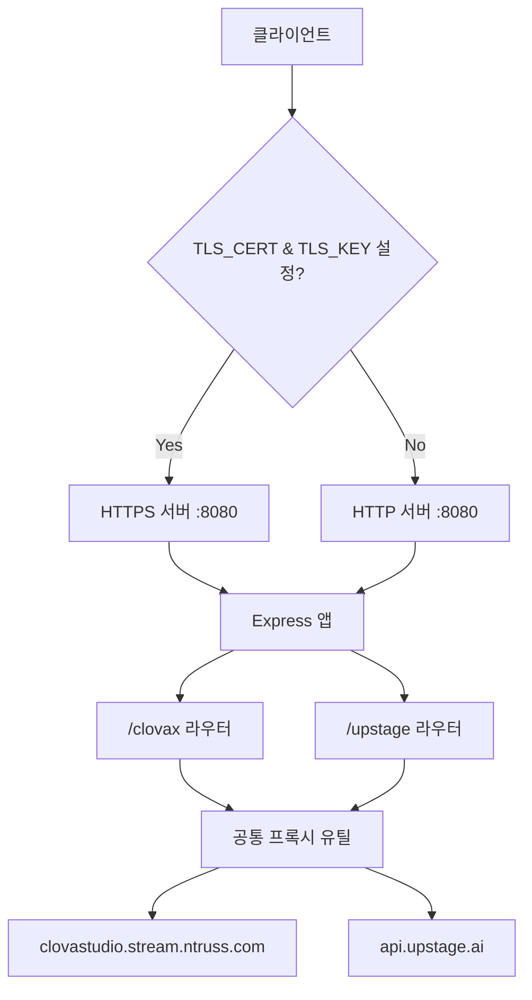
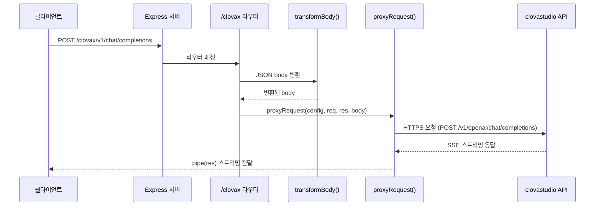
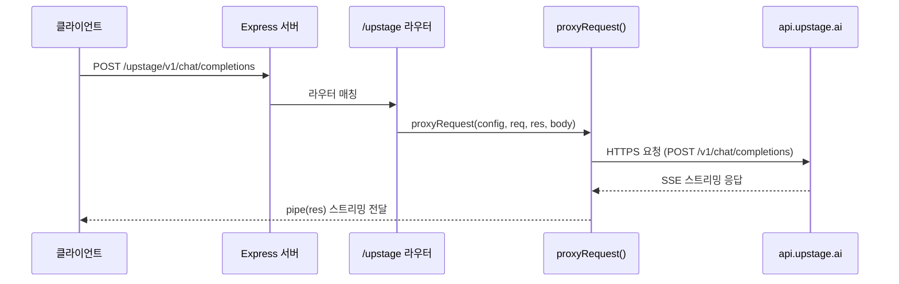

# 설계 문서: Express + TypeScript 라우터 분리 프록시 서버

## 개요

기존 `clovax/server.js`에 구현된 Node.js HTTP 프록시 서버를 Express + TypeScript 기반으로 재구성합니다. 현재 단일 파일에 모든 로직이 포함되어 있으며, `/v1/*` 경로만 처리하는 구조입니다.

재구성 후에는 `/clovax`와 `/upstage` 두 개의 독립적인 라우터로 분리하여, 각 프록시 대상(target)별로 독립적인 라우팅과 body 변환 로직을 관리할 수 있도록 합니다. body 변환 로직은 라우터별로 독립적으로 설정되며, 각 LLM 백엔드의 특성에 맞게 개별 적용됩니다. 현재 Clovax 라우터는 기존의 `parallel_tool_calls`, `tool_choice` 변환 로직을 유지하고, Upstage 라우터는 body 변환 없이 원본을 그대로 전달합니다.

`parallel_tool_calls`와 `tool_choice` 변환은 백엔드 LLM마다 구현이 다를 수 있으므로, 현재는 Clovax에 한정하여 적용합니다. 향후 다른 LLM 백엔드가 추가되거나 기존 백엔드의 요구사항이 변경될 경우, 각 라우터의 `TransformOptions`를 독립적으로 설정하여 유연하게 대응할 수 있는 구조입니다.

Express의 미들웨어 구조를 활용하여 공통 프록시 로직을 재사용하고, 라우터별로 타겟 호스트, 경로 매핑, body 변환 옵션을 독립적으로 설정하는 구조를 채택합니다.

## 아키텍처



## 시퀀스 다이어그램

### Clovax 프록시 요청 흐름



### Upstage 프록시 요청 흐름



## 컴포넌트 및 인터페이스

### 컴포넌트 1: Express 앱 (app.ts)

**목적**: Express 애플리케이션 초기화, 라우터 등록, HTTP/HTTPS 서버 시작

**인터페이스**:
```typescript
// Express 앱 생성 및 라우터 마운트
const app: Express = express();
app.use('/clovax', clovaxRouter);
app.use('/upstage', upstageRouter);

// TLS 설정에 따라 HTTP 또는 HTTPS 서버 시작
const tlsCert = process.env.TLS_CERT;
const tlsKey = process.env.TLS_KEY;

if (tlsCert && tlsKey) {
  // HTTPS 서버 기동
  const tlsOptions = {
    cert: fs.readFileSync(tlsCert),
    key: fs.readFileSync(tlsKey),
  };
  https.createServer(tlsOptions, app).listen(PORT);
} else {
  // HTTP 서버 기동 (기본)
  app.listen(PORT);
}
```

**책임**:
- Express 앱 인스턴스 생성
- raw body 파싱 미들웨어 설정
- 라우터 마운트
- TLS 환경변수 확인 및 HTTP/HTTPS 서버 분기 시작
- 인증서 파일 읽기 실패 시 에러 처리

### 컴포넌트 2: Clovax 라우터 (routes/clovax.ts)

**목적**: `/clovax/v1/*` 경로의 요청을 clovastudio API로 프록시

**책임**:

- `/v1/*` 하위 경로 처리
- Clovax 전용 body 변환 로직 적용 (`parallel_tool_calls → true`, `tool_choice → "auto"`)
- clovastudio.stream.ntruss.com으로 프록시 요청 전달

> **참고**: `parallel_tool_calls`와 `tool_choice` 변환은 Clovax 백엔드에 한정된 동작입니다. 다른 LLM 백엔드에서는 해당 필드의 처리 방식이 다를 수 있으므로, 각 라우터에서 독립적으로 `TransformOptions`를 설정합니다.

### 컴포넌트 3: Upstage 라우터 (routes/upstage.ts)

**목적**: `/upstage/v1/*` 경로의 요청을 Upstage API로 프록시

**책임**:

- `/v1/*` 하위 경로 처리
- body 변환 없이 원본 요청을 그대로 api.upstage.ai로 전달

> **참고**: Upstage 라우터는 `transformBody()`를 호출하지 않으며, 클라이언트가 보낸 요청 body를 변경 없이 그대로 프록시합니다.

### 컴포넌트 4: 프록시 유틸 (utils/proxy.ts)

**목적**: 공통 HTTPS 프록시 로직 및 body 변환 함수 제공

**책임**:

- HTTPS 프록시 요청 생성 및 스트리밍 응답 전달
- JSON body 변환 함수 제공 (호출 여부는 각 라우터가 결정)

## 데이터 모델

```typescript
// 프록시 대상 설정
interface ProxyConfig {
  hostname: string;   // 프록시 대상 호스트 (예: "clovastudio.stream.ntruss.com")
  port: number;       // 대상 포트 (기본 443)
  basePath: string;   // 대상 기본 경로 (예: "/v1/openai")
}

// TLS 설정 (HTTPS 서버 기동용)
// 환경변수 TLS_CERT, TLS_KEY가 모두 설정되면 HTTPS로 기동
interface TlsConfig {
  cert: string;   // TLS 인증서 파일 경로 (환경변수 TLS_CERT)
  key: string;    // TLS 개인키 파일 경로 (환경변수 TLS_KEY)
}

// body 변환 옵션 (라우터별로 독립적으로 설정)
// 각 LLM 백엔드의 특성에 맞게 개별 설정 가능
interface TransformOptions {
  forceParallelToolCalls?: boolean;  // parallel_tool_calls를 true로 강제 (현재 Clovax에서만 사용)
  forceToolChoiceAuto?: boolean;     // tool_choice를 "auto"로 강제 (현재 Clovax에서만 사용)
}

```

**유효성 규칙**:
- `hostname`은 빈 문자열이 아니어야 함
- `port`는 1~65535 범위의 정수
- `basePath`는 `/`로 시작해야 함
- `TlsConfig.cert`와 `TlsConfig.key`는 모두 존재하는 파일 경로여야 함
- TLS 환경변수는 둘 다 설정되거나 둘 다 미설정이어야 함 (하나만 설정 시 HTTP로 폴백)

## 핵심 함수 및 형식 명세

### 함수 1: transformBody()

> **적용 범위**: 현재 Clovax 라우터에서만 호출됩니다. Upstage 라우터는 이 함수를 호출하지 않고 원본 body를 그대로 전달합니다. 향후 다른 LLM 백엔드 추가 시, 해당 백엔드의 요구사항에 맞는 TransformOptions를 설정하여 독립적으로 사용할 수 있습니다.

```typescript
function transformBody(
  rawBody: Buffer,
  options: TransformOptions
): Buffer
```

**사전 조건(Preconditions)**:
- `rawBody`는 유효한 Buffer 인스턴스
- `options`는 정의된 TransformOptions 객체

**사후 조건(Postconditions)**:
- rawBody가 유효한 JSON이고 `parallel_tool_calls` 키가 존재하며 `options.forceParallelToolCalls`가 true이면, 반환된 JSON의 `parallel_tool_calls`는 `true`
- rawBody가 유효한 JSON이고 `tool_choice` 키가 존재하며 `options.forceToolChoiceAuto`가 true이면, 반환된 JSON의 `tool_choice`는 `"auto"`
- rawBody가 유효한 JSON이 아니면, 원본 Buffer를 그대로 반환
- 원본 rawBody는 변경되지 않음 (불변성)

**루프 불변식(Loop Invariants)**: 해당 없음

### 함수 2: proxyRequest()

```typescript
function proxyRequest(
  config: ProxyConfig,
  req: express.Request,
  res: express.Response,
  body: Buffer
): void
```

**사전 조건(Preconditions)**:
- `config`는 유효한 ProxyConfig (hostname 비어있지 않음, port 1~65535)
- `req`는 유효한 Express Request 객체
- `res`는 아직 헤더가 전송되지 않은 Express Response 객체
- `body`는 유효한 Buffer 인스턴스

**사후 조건(Postconditions)**:
- 대상 서버로 HTTPS 요청이 전송됨
- 대상 서버의 응답 상태 코드와 헤더가 클라이언트에 전달됨
- 대상 서버의 응답 본문이 `pipe()`를 통해 클라이언트에 스트리밍됨
- 프록시 요청 실패 시 502 상태 코드와 "Bad Gateway" 메시지 반환
- 요청 헤더의 `host`는 config.hostname으로 교체됨
- `content-length`는 변환된 body 길이로 갱신됨

**루프 불변식(Loop Invariants)**: 해당 없음

### 함수 3: buildTargetPath()

```typescript
function buildTargetPath(
  basePath: string,
  requestPath: string
): string
```

**사전 조건(Preconditions)**:
- `basePath`는 `/`로 시작하는 문자열
- `requestPath`는 `/v1/`로 시작하는 문자열

**사후 조건(Postconditions)**:
- 반환값은 `basePath + requestPath에서 "/v1" 제거한 나머지` 형태
- 예: basePath="/v1/openai", requestPath="/v1/chat/completions" → "/v1/openai/chat/completions"

**루프 불변식(Loop Invariants)**: 해당 없음

## 알고리즘 의사코드

### 프록시 요청 처리 알고리즘

```typescript
// 메인 프록시 처리 흐름
// Clovax: transformOpts 적용, Upstage: transformBody 호출 없이 원본 body 사용
function handleProxyRoute(
  config: ProxyConfig,
  transformOpts: TransformOptions | null,  // null이면 body 변환 없음
  req: Request,
  res: Response
): void {
  // 1단계: 경로 검증
  if (!req.path.startsWith('/v1/')) {
    res.status(404).send('Not Found');
    return;
  }

  // 2단계: raw body 수집
  const rawBody: Buffer = req.body; // express.raw() 미들웨어로 수집됨

  // 3단계: body 변환 적용 (라우터별 독립 설정)
  // transformOpts가 null이면 변환 없이 원본 사용 (예: Upstage)
  const finalBody: Buffer = transformOpts
    ? transformBody(rawBody, transformOpts)
    : rawBody;

  // 4단계: 대상 경로 생성
  const targetPath: string = buildTargetPath(config.basePath, req.path);

  // 5단계: 프록시 요청 전송
  proxyRequest(config, req, res, finalBody);
}
```

### Body 변환 알고리즘

```typescript
function transformBody(rawBody: Buffer, options: TransformOptions): Buffer {
  // 빈 body는 그대로 반환
  if (rawBody.length === 0) {
    return rawBody;
  }

  try {
    const json = JSON.parse(rawBody.toString());

    // parallel_tool_calls 강제 변환
    if (options.forceParallelToolCalls && 'parallel_tool_calls' in json) {
      json.parallel_tool_calls = true;
    }

    // tool_choice 강제 변환
    if (options.forceToolChoiceAuto && 'tool_choice' in json) {
      json.tool_choice = 'auto';
    }

    return Buffer.from(JSON.stringify(json));
  } catch {
    // JSON 파싱 실패 시 원본 반환
    return rawBody;
  }
}
```

## 사용 예시

```typescript
// === 서버 진입점 (app.ts) ===
import express from 'express';
import https from 'https';
import fs from 'fs';
import { clovaxRouter } from './routes/clovax';
import { upstageRouter } from './routes/upstage';

const app = express();
const PORT = process.env.PORT || 8080;

// raw body 파싱 (JSON 변환 전 원본 Buffer 유지)
app.use(express.raw({ type: '*/*', limit: '10mb' }));

// 라우터 마운트
app.use('/clovax', clovaxRouter);
app.use('/upstage', upstageRouter);

// TLS 환경변수 확인
const tlsCert = process.env.TLS_CERT;
const tlsKey = process.env.TLS_KEY;

if (tlsCert && tlsKey) {
  // HTTPS 서버 기동
  try {
    const tlsOptions = {
      cert: fs.readFileSync(tlsCert),
      key: fs.readFileSync(tlsKey),
    };
    https.createServer(tlsOptions, app).listen(PORT, () => {
      console.log(`HTTPS 프록시 서버 실행 중: :${PORT}`);
    });
  } catch (err) {
    console.error('TLS 인증서 파일 읽기 실패:', err);
    process.exit(1);
  }
} else {
  // HTTP 서버 기동 (기본)
  app.listen(PORT, () => {
    console.log(`HTTP 프록시 서버 실행 중: :${PORT}`);
  });
}
```

```typescript
// === Clovax 라우터 (routes/clovax.ts) ===
import { Router } from 'express';
import { proxyRequest, transformBody } from '../utils/proxy';
import { ProxyConfig, TransformOptions } from '../types';

const router = Router();

const config: ProxyConfig = {
  hostname: 'clovastudio.stream.ntruss.com',
  port: 443,
  basePath: '/v1/openai',
};

const transformOpts: TransformOptions = {
  forceParallelToolCalls: true,
  forceToolChoiceAuto: true,
};

// /clovax/v1/* 요청 처리
router.all('/v1/*', (req, res) => {
  const body = transformBody(req.body, transformOpts);
  proxyRequest(config, req, res, body);
});

export { router as clovaxRouter };
```

```typescript
// === Upstage 라우터 (routes/upstage.ts) ===
import { Router } from 'express';
import { proxyRequest } from '../utils/proxy';
import { ProxyConfig } from '../types';

const router = Router();

const config: ProxyConfig = {
  hostname: 'api.upstage.ai',
  port: 443,
  basePath: '/v1',
};

// /upstage/v1/* 요청 처리 (body 변환 없음)
router.all('/v1/*', (req, res) => {
  proxyRequest(config, req, res, req.body);
});

export { router as upstageRouter };
```

## 정확성 속성 (Correctness Properties)

*속성(property)은 시스템의 모든 유효한 실행에서 참이어야 하는 특성 또는 동작입니다. 속성은 사람이 읽을 수 있는 명세와 기계가 검증할 수 있는 정확성 보장 사이의 다리 역할을 합니다.*

### Property 1: 경로 매핑 정확성 (buildTargetPath)

*For any* basePath(`/`로 시작하는 문자열)와 requestPath(`/v1/`로 시작하는 문자열)에 대해, buildTargetPath(basePath, requestPath)는 basePath + requestPath에서 `/v1` 접두사를 제거한 나머지를 결합한 문자열을 반환해야 한다.

**Validates: Requirements 2.1, 4.1, 5.1**

### Property 2: body 변환 정확성 (transformBody)

*For any* 유효한 JSON body에 대해, `forceParallelToolCalls: true` 옵션으로 transformBody를 호출하면 `parallel_tool_calls` 키가 존재할 경우 해당 값이 `true`가 되고, `forceToolChoiceAuto: true` 옵션으로 호출하면 `tool_choice` 키가 존재할 경우 해당 값이 `"auto"`가 되어야 한다. 변환 대상이 아닌 다른 키-값 쌍은 변경되지 않아야 한다.

**Validates: Requirements 3.1, 3.2**

### Property 3: body 변환 멱등성

*For any* Buffer 입력과 TransformOptions에 대해, transformBody(input, options)를 한 번 호출한 결과와 그 결과를 다시 transformBody에 전달한 결과가 동일해야 한다. 즉, transformBody(transformBody(input, opts), opts) === transformBody(input, opts).

**Validates: Requirement 3.5**

### Property 4: 비JSON body 안전성

*For any* 유효한 JSON이 아닌 Buffer(빈 Buffer 포함)에 대해, transformBody를 호출하면 원본 Buffer와 바이트 단위로 동일한 결과를 반환해야 한다.

**Validates: Requirements 3.3, 3.4**

### Property 5: Upstage body 무변환

*For any* 요청 body에 대해, Upstage_라우터는 transformBody를 호출하지 않고 클라이언트가 보낸 원본 body를 그대로 대상 서버에 전달해야 한다.

**Validates: Requirement 4.2**

### Property 6: 헤더 전달 정확성

*For any* 요청 헤더 세트에 대해, proxyRequest는 `host` 헤더를 대상 호스트로 교체하고 `content-length`를 body 길이로 갱신하되, 나머지 헤더(Authorization 등)는 원본과 동일하게 대상 서버에 전달해야 한다.

**Validates: Requirements 2.2, 2.3, 4.3**

### Property 7: 응답 상태 코드 및 헤더 전달

*For any* 대상 서버의 응답 상태 코드와 헤더에 대해, proxyRequest는 해당 상태 코드와 헤더를 클라이언트에 그대로 전달해야 한다.

**Validates: Requirement 6.1**

## 에러 처리

### 에러 시나리오 1: 대상 서버 연결 실패

**조건**: 프록시 대상 서버(clovastudio 또는 upstage)에 연결할 수 없는 경우
**응답**: HTTP 502 Bad Gateway
**복구**: 에러 로그 출력, 클라이언트에 에러 응답 전송

### 에러 시나리오 2: 잘못된 경로 요청

**조건**: `/clovax/v1/*` 또는 `/upstage/v1/*` 패턴에 맞지 않는 경로 요청
**응답**: HTTP 404 Not Found
**복구**: Express 기본 404 핸들러로 처리

### 에러 시나리오 3: JSON 파싱 실패

**조건**: 요청 body가 유효한 JSON이 아닌 경우
**응답**: 원본 body를 그대로 프록시 (에러 발생하지 않음)
**복구**: try-catch로 파싱 실패를 무시하고 원본 전달

### 에러 시나리오 4: TLS 인증서 파일 읽기 실패

**조건**: `TLS_CERT` 또는 `TLS_KEY` 환경변수가 설정되었으나 해당 파일이 존재하지 않거나 읽기 권한이 없는 경우
**응답**: 서버가 시작되지 않음
**복구**: 에러 메시지(`TLS 인증서 파일 읽기 실패`)를 stderr에 출력하고 `process.exit(1)`로 프로세스 종료. 운영자가 인증서 파일 경로 및 권한을 확인 후 재시작

### 에러 시나리오 5: TLS 환경변수 불완전 설정

**조건**: `TLS_CERT`와 `TLS_KEY` 중 하나만 설정된 경우
**응답**: HTTP 서버로 폴백하여 정상 기동
**복구**: 경고 로그 출력 후 HTTP 모드로 서버 시작. 운영자가 누락된 환경변수를 추가 설정하여 HTTPS 활성화 가능

## 테스트 전략

### 단위 테스트

- `transformBody()`: 다양한 JSON 입력에 대한 변환 정확성 검증 (Clovax 라우터 전용)
- `buildTargetPath()`: 경로 매핑 정확성 검증
- 비JSON body 처리 안전성 검증
- Upstage 라우터가 `transformBody()`를 호출하지 않고 원본 body를 그대로 전달하는지 검증

### 속성 기반 테스트 (Property-Based Testing)

**테스트 라이브러리**: fast-check

- `transformBody()` 멱등성 (Clovax 한정): 임의의 JSON에 대해 두 번 변환해도 결과 동일
- 비JSON 안전성: 임의의 비JSON 문자열에 대해 원본 유지
- 경로 매핑: 임의의 `/v1/*` 경로에 대해 올바른 대상 경로 생성
- Upstage body 무변환: 임의의 body에 대해 Upstage 라우터는 원본과 동일한 body를 전달

### 통합 테스트

- Express 서버 기동 후 `/clovax/v1/chat/completions` 요청 → 올바른 대상으로 프록시 확인
- Express 서버 기동 후 `/upstage/v1/chat/completions` 요청 → 올바른 대상으로 프록시 확인
- SSE 스트리밍 응답 정상 전달 확인
- `TLS_CERT`와 `TLS_KEY` 환경변수 설정 시 HTTPS 서버로 기동되는지 확인
- TLS 환경변수 미설정 시 HTTP 서버로 기동되는지 확인
- 잘못된 인증서 파일 경로 설정 시 서버가 에러와 함께 종료되는지 확인

## 프로젝트 구조

```
clovax/
├── src/
│   ├── app.ts              # Express 앱 초기화, 라우터 마운트, HTTP/HTTPS 서버 시작
│   ├── types.ts            # 타입 정의 (ProxyConfig, TlsConfig, TransformOptions)
│   ├── utils/
│   │   └── proxy.ts        # 공통 프록시 유틸 (proxyRequest, transformBody, buildTargetPath)
│   └── routes/
│       ├── clovax.ts       # /clovax 라우터
│       └── upstage.ts      # /upstage 라우터
├── tsconfig.json
├── package.json
├── Dockerfile
└── run.sh
```

### Docker 환경에서 TLS 인증서 사용

HTTPS 모드로 실행하려면 TLS 인증서 파일을 컨테이너에 마운트하고 환경변수를 설정합니다.

```bash
# Docker 실행 예시 (HTTPS 모드)
docker run -d \
  -p 8080:8080 \
  -v /path/to/certs/server.crt:/certs/server.crt:ro \
  -v /path/to/certs/server.key:/certs/server.key:ro \
  -e TLS_CERT=/certs/server.crt \
  -e TLS_KEY=/certs/server.key \
  proxy-server

# Docker 실행 예시 (HTTP 모드, 기본)
docker run -d -p 8080:8080 proxy-server
```

> **참고**: 인증서 파일은 읽기 전용(`:ro`)으로 마운트하는 것을 권장합니다. `TLS_CERT`와 `TLS_KEY` 환경변수를 설정하지 않으면 기존과 동일하게 HTTP 서버로 기동됩니다.

## 의존성

- **express**: HTTP 서버 프레임워크
- **typescript**: 타입 안전성
- **@types/express**: Express 타입 정의
- **@types/node**: Node.js 타입 정의 (`https`, `fs` 모듈 포함)
- **tsx** (개발용): TypeScript 직접 실행
